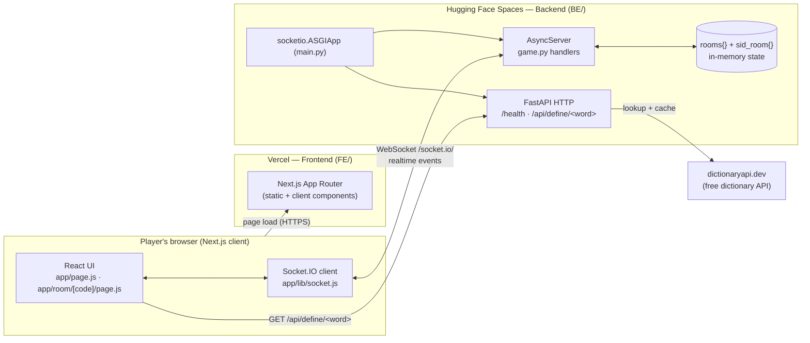
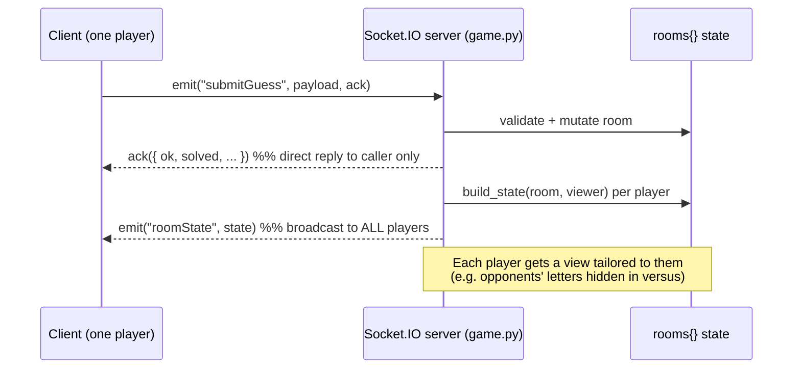
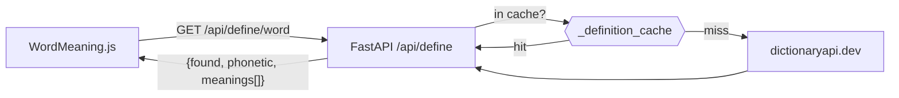
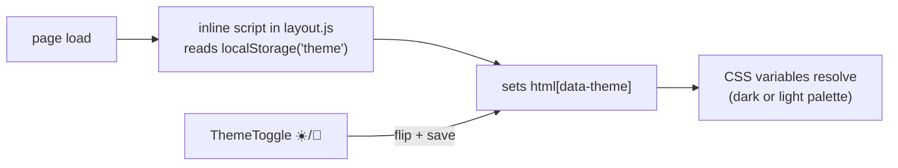

# Architecture & Feature Guide

This document explains how Multiplayer Wordle is put together and how every
feature works end to end. It complements the setup/deploy instructions in
[`README.md`](./README.md).

- [System architecture](#system-architecture)
- [Component map](#component-map)
- [Data model](#data-model-in-memory-on-the-backend)
- [Socket.IO event reference](#socketio-event-reference)
- [Feature walkthroughs](#feature-walkthroughs)
  - [1. Create / join a room](#1-create--join-a-room)
  - [2. Lobby: mode & word length](#2-lobby-mode--word-length)
  - [3. Guess scoring (shared)](#3-guess-scoring-shared)
  - [4. Co-op mode](#4-co-op-mode)
  - [5. Versus mode](#5-versus-mode)
  - [6. Scoring & winners](#6-scoring--winners)
  - [7. Word definitions](#7-word-definitions)
  - [8. Reconnect, disconnect & host migration](#8-reconnect-disconnect--host-migration)
  - [9. Play again](#9-play-again)
  - [10. Themes (light / dark)](#10-themes-light--dark)
  - [11. How-to-play modal](#11-how-to-play-modal)

---

## System architecture

The app is split into two independently deployed services. The browser holds a
single persistent **WebSocket (Socket.IO)** connection for realtime gameplay and
makes ordinary **HTTP** calls for word definitions.



**Why two services?** Vercel is serverless and can't hold a long-lived WebSocket
server, so the realtime FastAPI + Socket.IO backend runs as a Docker Space on
Hugging Face Spaces while the Next.js frontend is served from Vercel. The
client finds the backend through the `NEXT_PUBLIC_BACKEND_URL` env var
(defaults to `http://localhost:8000`). The deployed Space is
[`Nadan11111/wordle`](https://huggingface.co/spaces/Nadan11111/wordle),
serving on `https://nadan11111-wordle.hf.space`; the live frontend is at
<https://multiplayer-wordle-pied.vercel.app/>.

### Realtime request shape

Almost all gameplay flows through one pattern: the client **emits** an event
(sometimes with an acknowledgement callback for instant validation feedback),
the backend mutates the in-memory room, then **broadcasts** the new room state
to every connected player.



---

## Component map

```
FE/  (Next.js App Router — deploy to Vercel)
├── app/page.js                  Home: enter name, create or join a room
├── app/room/[code]/page.js      The whole game room: name prompt, lobby,
│                                 co-op + versus play, and results overlays
├── app/layout.js                Root layout; inline script applies the saved
│                                theme before first paint (no flash)
├── app/components/
│   ├── Board.js                 6-row tile grid (your/shared board), N columns
│   ├── Keyboard.js              On-screen keyboard with per-key colour states
│   ├── OpponentBoard.js         Mini board for each versus opponent (colours only)
│   ├── WordMeaning.js           Fetches + renders the answer's definition
│   ├── HowToPlay.js             "How to play" button + rules modal
│   └── ThemeToggle.js           Theme picker: dark / light / colour-blind
├── app/globals.css              Theme variables (dark + light) and all styling
├── app/lib/socket.js            Single shared Socket.IO client (getSocket())
└── app/lib/config.js            Reads NEXT_PUBLIC_BACKEND_URL

BE/  (FastAPI + python-socketio — deploy to Hugging Face Spaces)
├── main.py                      FastAPI app, CORS, /health, /api/define proxy,
│                                and the socketio.ASGIApp entrypoint
├── game.py                      All game logic: rooms, players, Socket.IO
│                                handlers, scoring, state broadcasting
├── words.py                     Curated 4/5/6-letter word lists + Wordle scoring
└── Dockerfile                   Container image used by HF Spaces (port 7860)
```

---

## Data model (in-memory on the backend)

State lives in two module-level dicts in `game.py`. There is **no database** —
everything resets if the backend restarts.

```
rooms:     code (e.g. "AB3K")  ->  room dict
sid_room:  socket id           ->  room code   (reverse lookup)
```

A **room** (`new_room`):

| Field | Meaning |
| --- | --- |
| `code` | 4-char join code (omits easily-confused chars like `0`/`O`, `1`/`I`) |
| `status` | `"lobby"` → `"playing"` → `"finished"` |
| `mode` | `"coop"` or `"versus"` (host-chosen) |
| `wordLength` | `4`, `5`, or `6` (host-chosen in the lobby; default 5) |
| `hostId` | socket id of the host |
| `word` | the secret answer (only sent to clients once `finished`) |
| `guesses` | **co-op:** shared submitted rows `[{letters, result, by}]` |
| `draft` | **co-op:** the in-progress shared row everyone sees being typed |
| `draftAuthors` | **co-op:** parallel array — which sid typed each draft letter |
| `typingBy` | **co-op:** name shown in the "✏️ … is typing" indicator |
| `outcome` | **co-op:** `"won"` / `"lost"` |
| `mvpId` | **co-op:** round winner (typed the most letters) |
| `winnerId` | **versus:** first player to solve |
| `solveCount` | **versus:** how many have solved (used to assign ranks) |
| `players` | list of player dicts |

A **player** (`new_player`):

| Field | Meaning |
| --- | --- |
| `id` | socket id |
| `name`, `connected`, `isHost` | identity / presence |
| `score` | **cumulative wins across rounds** (preserved on Play Again) |
| `guesses`, `solved`, `finished`, `rank` | **versus:** this player's own board & result |
| `chars` | **co-op:** letters this player contributed this round |

---

## Socket.IO event reference

**Client → server** (some take an ack callback for an immediate reply):

| Event | Payload | Server does |
| --- | --- | --- |
| `createRoom` | – | Generates a code, creates the room, returns `{ code }` |
| `joinRoom` | `{ code, name }` | Adds/re-attaches the player; first joiner becomes host |
| `setMode` | `{ mode }` | Host-only, lobby-only: switch co-op/versus |
| `setWordLength` | `{ length }` | Host-only, lobby-only: set word length to 4, 5, or 6 |
| `startGame` | – | Host-only: pick a word, reset the round, status → `playing` |
| `type` | `{ op }` | Co-op only: `op` is a letter or `"BACKSPACE"`, edits shared draft |
| `submitGuess` | `{}` (co-op) / `{ guess }` (versus) | Validate + score a guess |
| `playAgain` | – | Host-only: reset round, status → `lobby` |

**Server → client:**

| Event | Meaning |
| --- | --- |
| `roomState` | The full room view tailored to the receiving player. The client re-renders entirely from this; it's the single source of truth. |

The per-player tailoring happens in `build_state(room, viewer_id)`: in versus
mode `_versus_view_player` hides opponents' letters (`letters: null`) while still
streaming their tile **colours**, so you see opponents' progress but not their words.

---

## Feature walkthroughs

### 1. Create / join a room

- **Home page** (`app/page.js`) stores your name in `sessionStorage` and either
  emits `createRoom` (then routes to `/room/<code>`) or routes straight to a
  code you typed.
- **Room page** (`app/room/[code]/page.js`) emits `joinRoom` on mount. If no
  saved name exists it shows a name prompt first.
- On the backend, `join_room` appends a `new_player`, and the **first** player to
  join becomes `hostId`. Versus games are **locked once started** (you can't join
  mid-race); co-op games let you jump in at any time.
- The room code generator (`generate_code`) avoids ambiguous characters and
  retries until it finds an unused code.

### 2. Lobby: mode & word length

- While `status === "lobby"`, the host sees two pickers:
  - a **co-op/versus toggle** that emits `setMode`, and
  - a **word-length selector** (4 / 5 / 6) that emits `setWordLength`.
  Non-hosts see both but the controls are disabled.
- Both are guarded server-side: each only applies if the caller is the host
  **and** the room is still in the lobby. `setWordLength` additionally validates
  the value against `SUPPORTED_LENGTHS` (`words.py`).
- The chosen `wordLength` flows to clients in `build_state`, and the React UI
  uses it everywhere a board is drawn or a guess is typed/validated:
  `Board`/`OpponentBoard` render that many columns (via an inline
  `grid-template-columns`), and the typing/submit logic caps and checks against
  it instead of a hard-coded 5.
- The host's **Start game** button emits `startGame`, which calls `reset_round`.
  That picks a random answer of the chosen length via
  `get_random_word(room["wordLength"])` and flips status to `playing`.

> **Word lists & scoring across lengths** — `words.py` holds curated lists per
> length in `WORDS_BY_LENGTH` (4, 5, 6), each doubling as the answer pool and the
> accepted-guess dictionary for that length. `is_valid_word(word, length)` checks
> the right set, and `score_guess` is length-agnostic (it scores over
> `len(answer)`), so the duplicate-letter colouring rules apply identically at
> every length.

### 3. Guess scoring (shared)

Both modes score guesses with `score_guess(guess, answer)` in `words.py`, which
implements **standard Wordle colouring with correct duplicate-letter handling**:

1. First pass marks exact matches `correct` and tallies the *remaining*
   (non-correct) answer letters.
2. Second pass marks a letter `present` only if an unused copy remains in that
   tally, otherwise `absent`.

This two-pass approach is why a guessed letter that appears twice but exists once
in the answer gets one `present` and one `absent`, matching real Wordle.

Guesses must match the room's word length and exist in that length's curated
list (`is_valid_word(guess, room["wordLength"])`); otherwise the ack returns
`{ ok: false, error }` and the UI shakes the row and shows a toast.

### 4. Co-op mode

> One shared board. Anyone can type into the shared row; the whole team has 6
> guesses to crack one word together.

```mermaid
sequenceDiagram
    participant A as Alice
    participant B as Bob
    participant S as Server

    A->>S: type {op:"C"}
    S->>S: draft="C", draftAuthors=["Alice"]
    S-->>A: roomState (draft "C", typingBy Alice)
    S-->>B: roomState (sees "C" appear live)
    B->>S: type {op:"R"}
    S->>S: draft="CR", draftAuthors=["Alice","Bob"]
    Note over A,B: ...team fills "CRANE"...
    A->>S: submitGuess {}
    S->>S: score_guess; credit chars per draftAuthors;<br/>append to guesses; clear draft
    alt solved or 6 guesses used
        S->>S: status="finished"; _award_coop_mvp()
    end
    S-->>A: roomState
    S-->>B: roomState
```

- **Shared draft:** there is no local typing in co-op — every keystroke is a
  `type` event. The server edits the single shared `draft` and broadcasts it, so
  teammates watch letters appear in real time, along with a "✏️ Alice is typing…"
  indicator (`typingBy`).
- **Letter attribution:** `draftAuthors` runs parallel to `draft`. Typing a
  letter appends your sid; **backspace pops the last author** (so you lose credit
  for letters you erase). On submit, each letter still in the row is credited to
  whoever typed it via `player["chars"] += 1`. This feeds the co-op winner — see
  [Scoring & winners](#6-scoring--winners).
- **Ending:** the round finishes when a guess is all `correct` (`outcome="won"`)
  or the 6th guess is used (`outcome="lost"`). Either way `_award_coop_mvp` runs.
- The sidebar shows a live **"N letters"** count per player during play, so the
  contribution race is visible as you go.

### 5. Versus mode

> Everyone gets their own board with the **same word** and races to solve it first.

```mermaid
sequenceDiagram
    participant A as Alice
    participant B as Bob
    participant S as Server

    A->>S: submitGuess {guess:"CRANE"}
    S->>S: score Alice's board; solved → finished,<br/>rank=1, winnerId=Alice
    S-->>A: ack {ok, result, solved:true}
    S-->>A: roomState (own letters shown)
    S-->>B: roomState (Alice's colours shown, letters hidden)
    B->>S: submitGuess {guess:"SLATE"}
    S->>S: score Bob's board
    Note over S: maybe_finish_versus(): when ALL players<br/>finished → status="finished", award winner
    S-->>A: roomState
    S-->>B: roomState
```

- Each player types into a **local** draft (`current` in React state) and sends
  the whole word with `submitGuess`. The ack returns the colour `result` for
  instant board updates.
- Opponents' boards stream **colours only** — `_versus_view_player` sets
  `letters: null` for anyone who isn't you (unless the round is over and
  everything is revealed). The `OpponentBoard` component renders these colour-only
  mini boards.
- A player is `finished` when they solve or use all 6 guesses. The first solver
  becomes `winnerId` and gets `rank = solveCount`. When **every** player is
  finished, `maybe_finish_versus` ends the round.

### 6. Scoring & winners

Each player has a cumulative `score` (wins) that **persists across rounds** and
is only reset by a fresh start, not by Play Again. Each mode decides the round
winner differently:

| Mode | Winner | How it's computed |
| --- | --- | --- |
| **Versus** | The player who solved **fastest** | First solver is stored as `winnerId` (rank 1). `_award_versus_winner` gives them `score += 1` when the round finishes. |
| **Co-op** | The player who **typed the most letters** into submitted guesses | `_award_coop_mvp` picks the player with the highest `chars`, stores them as `mvpId`, and gives `score += 1`. |

**Where winners are shown:**

- **Versus results** (`VersusResults`): players are ranked 🥇🥈🥉 by solve order,
  with a "🏆 _name_ wins!" banner, each player's attempts (`x/6`), and their
  cumulative win count.
- **Co-op results** (`CoopResults`): a "🏆 _name_ put in the most letters and
  takes the round!" banner plus a list ranking everyone by letters contributed
  this round and their cumulative wins.

Tie-breaking in co-op favours the earliest player in the list (the comparison
uses a strict `>`), and if no letters were contributed, no MVP is awarded.

### 7. Word definitions

When a round ends, `WordMeaning` calls `GET /api/define/<answer>` on the backend.



- `main.py`'s `define` endpoint proxies the free **dictionaryapi.dev** API,
  trims it to phonetic + up to 3 meanings, and **caches each word in memory** so
  repeat lookups are instant. Failures degrade gracefully to `{ found: false }`.
- This is a proxy (rather than calling the dictionary API from the browser) so
  CORS and response shaping are handled server-side.

### 8. Reconnect, disconnect & host migration

- The client keeps a **single shared socket** (`getSocket()`); on `connect`/
  reconnect it re-emits `joinRoom` with the saved name to re-attach to the room.
- On `disconnect`, the backend removes the player from the room. If the room is
  now empty it's deleted. If the **host** left, the host role migrates to the
  first remaining player (`hostId = players[0].id`).
- A disconnect in versus also calls `maybe_finish_versus`, so a round can still
  conclude if the last unfinished player drops.

### 9. Play again

- The host's **Play again** button emits `playAgain`, which returns the room to
  the **lobby** and clears all per-round state — boards, draft, `draftAuthors`,
  `chars`, `mvpId`, `winnerId`, etc.
- **Cumulative `score` is intentionally kept**, so wins accumulate across rounds
  and the results screens reflect the running tally for the session.
- The room's `wordLength` (and `mode`) **persist** through Play Again, so the
  next round keeps the host's chosen settings unless they're changed in the lobby.

### 10. Themes (dark / light / colour-blind)

Theming is **purely client-side** — it never touches the backend or room state.
There are three palettes:

| Theme | Background | `correct` | `present` |
| --- | --- | --- | --- |
| **Dark** (default) | dark | green | yellow |
| **Light** | light | green | yellow |
| **Color-blind** | dark | **orange** `#f5793a` | **blue** `#85c0f9` |

The colour-blind (high-contrast) palette swaps green/yellow for orange/blue,
which stay distinguishable with red-green colour blindness. Because orange and
blue are light fills, a scoped rule gives those tiles/keys **dark letters** for
legibility (the dark "absent" tile keeps white letters).

- All colours are CSS custom properties in `app/globals.css`. The dark palette
  lives under `:root` / `:root[data-theme="dark"]`; `:root[data-theme="light"]`
  and `:root[data-theme="colorblind"]` override them. Components reference
  variables only (e.g. `--bg`, `--correct`, `--key-bg`), so changing one
  attribute restyles the whole app.
- `ThemeToggle.js` (a `<select>` in the header) sets `document.documentElement`'s
  `data-theme` and saves the choice to `localStorage`.
- **No flash of the wrong theme:** an inline script in `app/layout.js` runs
  before first paint, reads `localStorage`, and sets `data-theme` on `<html>`.
  The default is dark. `<html>` carries `suppressHydrationWarning` because that
  attribute is set by the script rather than React.



### 11. How-to-play modal

- `HowToPlay.js` renders a **"How to play"** button (in the header on the home
  page and in every room) plus a modal overlay explaining tile colours, the
  colour-blind palette (with fixed orange/blue swatches that preview it
  regardless of the active theme), the two modes, and how winners are decided.
- It's self-contained client state — no socket traffic. It closes on the ✕
  button, the backdrop, the "Got it" button, or the **Escape** key, and reuses
  the shared `.overlay` / `.card` styles.

---

## Extending the app

- **Persisting / scaling:** state is the in-memory `rooms` dict in `game.py`.
  Swap it for Redis to survive restarts or run multiple backend instances.
- **More guessable words:** add entries to the relevant list in
  `WORDS_BY_LENGTH` in `words.py` (each length's list doubles as both the answer
  pool and the accepted-guess dictionary).
- **A new word length:** add a list under a new key in `WORDS_BY_LENGTH`;
  `SUPPORTED_LENGTHS`, validation, and scoring pick it up automatically. Add the
  value to the lobby selector (`[4, 5, 6]`) in `app/room/[code]/page.js`.
- **New game modes:** add a `mode` value, branch in `build_state`, `submitGuess`,
  and the round-finish/award helpers, then add a matching results component on
  the frontend.
- **A new theme:** add a `:root[data-theme="..."]` block in `globals.css` with
  the same variable names, then add an entry to the `THEMES` list in
  `ThemeToggle.js`.
